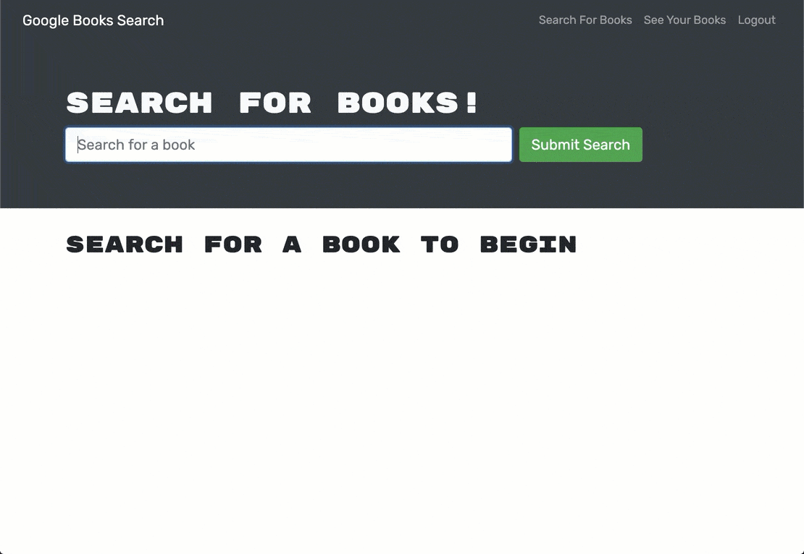

# 18 MERN: Book Search Engine

This is a full-stack web application that allows users to search for books via the Google Books API and save their favorites to a MongoDB database. Originally built with RESTful APIs, this version has been **refactored to use GraphQL with Apollo Server and Client**.

## Features

```md
- 🔍 Search for books by title or keyword using the Google Books API
- 🔐 User authentication with JWT
- 📥 Save and remove books to your personal profile
- 📄 Persistent book data stored in MongoDB Atlas
- ⚙️ Fully integrated with GraphQL (Apollo Server + Apollo Client)
```

## Tecnologies Used

- **Frontend**: React, TypeScript, Apollo Client, Bootstrap
- **Backend**: Node.js, Express, TypeScript, Apollo Server
- **Database**: MongoDB + Mongoose
- **Authentication**: JSON Web Tokens (JWT)
- **Deployment**: Render (frontend + backend), MongoDB Atlas (cloud DB)

## Project Structure

book-search-engine/
├── client/ # React frontend with Apollo Client
│ ├── src/
│ │ ├── pages/ # SearchBooks, SavedBooks, Profile
│ │ ├── utils/ # auth, mutations, queries, API helpers
│ └── ...
├── server/ # Node + Apollo Server backend
│ ├── src/
│ │ ├── models/ # User and Book Mongoose models
│ │ ├── schemas/ # GraphQL typeDefs and resolvers
│ └── ...


### User Flow


1. User signs up or logs in
2. Can search for books via the input
3. Sees a list of results with title, author, description, image, and Google Books link
4. If logged in:
   - Can click **"Save This Book!"** to store it in MongoDB
   - Can visit **Saved Books** to see and remove saved books

---


### Local Development Setup

- Node.js + npm
- MongoDB (local or Atlas)
- VSCode recommended


## Detail

> **Note:** Book Search Engine is a full-stack web application that allows users to search for books using the Google Books API and save their favorite titles to a personal library. It features a GraphQL backend powered by Apollo Server and a modern React frontend, offering a secure and smooth user experience with persistent login and saved data.




## 📹 Demo & Repository

### 🔗 Live Demo (Video)

Watch a walkthrough of the application in action:

👉 [Watch Video Demo](https://drive.google.com/file/d/13utxWOvKsu26LLMhci3OPzADNa_rpHjB/view?usp=drive_link)

### 💻 GitHub Repository

Access the source code here:

👉 [Book Search Engine GitHub Repo](https://github.com/MichGuzman/Book-Search-Engine)


👩🏻‍💻 Developed by

Michelle Guzmán
GitHub: @MichGuzman

📄 License
This project is licensed under the MIT License.

---
© 2025 edX Boot Camps LLC. Confidential and Proprietary. All Rights Reserved.
